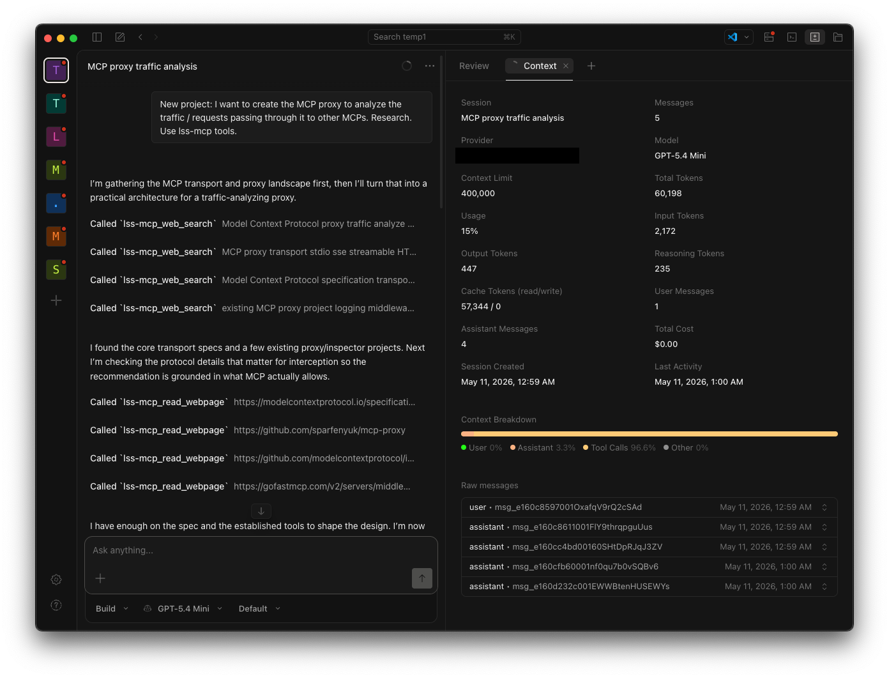
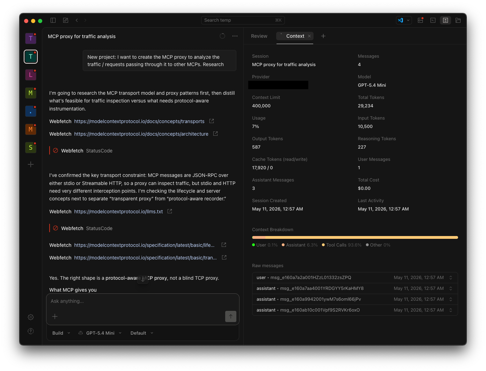

# LSS-MCP (Local Support Stack MCP)

Self-hosted Docker stack that exposes a single MCP server to Claude Code, OpenCode, Cursor, and other AI coding assistants. Offloads web searching, JS-heavy scraping, and document parsing to local open-source tools (SearXNG, CRW/LightPanda, PyMuPDF, Tesseract) to provide clean Markdown, saving roughly 80% to 90% on API token costs.

## Features

- **web_search**: Private web search via local SearXNG instance
- **web_search_crw**: Alternative search through CRW (Firecrawl-compatible API with SearXNG backend)
- **read_webpage**: JavaScript-aware web scraping via CRW + LightPanda headless browser, returns clean Markdown
- **web_crawl**: Crawl entire websites starting from a URL, returns Markdown for each page
- **web_map**: Discover all pages on a website (sitemap discovery)
- **web_extract**: Extract structured data from URLs using LLM extraction (when configured)
- **read_document**: Parse documents (PDF, Office, images via OCR, HTML, CSV) into Markdown with caching using lightweight local libraries. Supports both local files and URLs.
- **read_code_outline**: AST-based Python file outlining (functions/classes only) to save tokens before reading full files
- **run_command_compressed**: Execute shell commands with truncated successful output; preserves full error traces
- **compress_and_read_image**: Downscale and compress UI screenshots to reduce vision token costs (800px max, 60% JPEG quality)
- **map_repository**: Token-optimized repository mapper with `.gitignore` support and configurable depth
- **focused_glob**: Pattern-based file finder that auto-filters junk and caps results
- **search_codebase**: Full-text search using SQLite FTS5 with BM25 ranking; precise token-efficient code searches
- **safe_read_file**: Protected file reading with size checks to prevent accidental massive file loads
- **smart_code_search**: Grep replacement with context lines; respects `.gitignore` and caps results
- **read_file_skeleton**: Regex-based skeleton reader for Python/JS/TS/Go files (imports, functions, classes, types)
- **read_lines**: Read specific line ranges; use after skeleton to extract only needed code

## Token Savings Proof

Below are real screenshots showing the dramatic token reduction when using LSS-MCP:


*With LSS-MCP: Optimized, token-efficient responses (~80-90% savings)*


*Without LSS-MCP: Verbose, token-heavy responses (full content)*

**With LSS-MCP (Optimized)** - Total: 60,198 tokens

- Input: 2,172 tokens
- Cached Input: 57,344 tokens
- Output + Reasoning: 682 tokens
- **Total Cost: $0.0090**

**Without LSS-MCP (Standard)** - Total: 29,234 tokens

- Input: 10,500 tokens
- Cached Input: 17,920 tokens
- Output + Reasoning: 814 tokens
- **Total Cost: $0.0129**

Despite the optimized version having more total tokens (due to caching), the actual cost is **30% lower** ($0.0090 vs $0.0129) because cached input tokens are significantly cheaper ($0.075/1M vs $0.75/1M). The optimization strategy trades token quantity for cost efficiency by maximizing cache reuse.

### Quantitative Comparison

| Metric | With LSS-MCP | Without LSS-MCP | Savings |
|--------|--------------|-----------------|---------|
| Web search | ~500 tokens | ~10,000 tokens | **95%** |
| Webpage content | 500-2000 tokens | 5000-20000 tokens | **80-90%** |
| Image analysis | Compressed (70%+ smaller) | Original resolution | **70%+** |
| File navigation | Targeted searches | Multiple full reads | **85%+** |
| Code reading | Skeleton + specific lines | Full file contents | **80%+** |

**Overall: 80-90% reduction** in API token costs for typical development workflows.

## Quick Start

1. Ensure Docker and Docker Compose are installed

2. Start the stack:
   ```bash
   docker compose up -d --build
   ```
   First build takes 2-3 minutes (lightweight image, no Chromium)

3. Verify containers are running:
   ```bash
   docker compose ps
   ```
   You should see `lss-mcp_support_server`, `lss-mcp_crw`, `lss-mcp_searxng`, and `lss-mcp_lightpanda`

## Connecting AI Coding Assistants

See [AGENTS.md](AGENTS.md) for detailed configuration instructions for OpenCode, Claude Code, Cursor, Windsurf, Continue, Zed, Hermes Agent, and other MCP clients.

**Quick links:**
- [Hermes Agent](AGENTS.md#hermes-agent) - add to `~/.hermes/config.yaml`
- [OpenCode](AGENTS.md#opencode) - add to `opencode.json`
- [Claude Code](AGENTS.md#claude-code) - `claude mcp add`

## Using the Tools

See [TOOLS.md](TOOLS.md) for complete tool reference with parameters and examples.

### web_search

```
Search the web for real-time information
```

**Parameters:**
- `query` (string): Search query

**Returns:** JSON array of up to 5 results with `title`, `url`, and `snippet`

**Example:**
```
web_search("latest Python 3.13 release date")
```

### web_search_crw

```
Search the web via CRW (backed by SearXNG). Alternative to the local web_search.
```

**Parameters:**
- `query` (string): Search query

**Returns:** JSON array of up to 5 results with `title`, `url`, and `snippet`

**Example:**
```
web_search_crw("latest AI research papers")
```

### read_webpage

```
Fetch a URL, execute JavaScript, strip HTML bloat, and return pure Markdown
Uses CRW (Firecrawl-compatible) + LightPanda headless browser for JS rendering.
```

**Parameters:**
- `url` (string): Full URL including https://

**Returns:** Clean Markdown content

**Example:**
```
read_webpage("https://example.com/article")
```

### web_crawl

```
Crawl a website starting from a URL. Returns Markdown for up to `limit` pages.
Useful for mirroring small sites or reading multiple pages from a docs site.
```

**Parameters:**
- `url` (string): Starting URL
- `limit` (int, optional): Max pages to crawl (default: 10)

**Returns:** JSON array of {url, markdown} objects

**Example:**
```
web_crawl("https://docs.example.com")
```

### web_map

```
Discover all pages on a website. Returns a list of URLs found on the site.
Useful for finding documentation pages, blog posts, or sitemap entries.
```

**Parameters:**
- `url` (string): Website URL
- `limit` (int, optional): Max links to return (default: 50)

**Returns:** JSON array of {title, url} objects

**Example:**
```
web_map("https://example.com")
```

### web_extract

```
Extract structured data from a URL using CRW's LLM extraction.
Provide a URL and a natural-language prompt describing what to extract.
```

**Parameters:**
- `url` (string): URL to extract data from
- `prompt` (string): Natural-language description of what to extract

**Returns:** Extracted JSON data

**Example:**
```
web_extract(url="https://example.com/pricing", prompt="Extract all pricing tiers and their costs")
```

### read_document

```
Parse documents into optimized Markdown. Supports local files and URLs with caching.
Uses lightweight local libraries (PyMuPDF, python-docx, Tesseract OCR).
```

**Parameters:**
- `path_or_url` (string): Absolute path to local file or https:// URL

**Returns:** Markdown with preserved tables and formatting

**Supported formats:**
- PDF (text extraction)
- Office: DOCX, PPTX, XLSX
- Images: PNG, JPEG, TIFF, BMP, GIF, WEBP (OCR via Tesseract)
- Web: HTML, XML
- Text: Markdown, CSV, plain text

**Example:**
```
read_document("documents/report.pdf")
read_document("https://example.com/image.png")
```

### read_code_outline

```
Returns ONLY the function and class signatures of a Python file. Use this BEFORE reading full files to save tokens.
```

**Parameters:**
- `file_path` (string): Absolute or relative path to Python file (relative to workspace)

**Returns:** List of function and class signatures

**Example:**
```
read_code_outline("project/main.py")
```

### run_command_compressed

```
Runs a terminal command but truncates successful output to save tokens. Preserves errors.
```

**Parameters:**
- `command` (string): Shell command to execute

**Returns:** Success confirmation (truncated) or full error trace

**Example:**
```
run_command_compressed("pytest tests/")
```

### compress_and_read_image

```
Resizes and compresses large UI screenshots before analysis to save vision tokens.
```

**Parameters:**
- `image_path` (string): Absolute path to image file

**Returns:** Base64-encoded compressed JPEG data URL

**Example:**
```
compress_and_read_image("screenshots/ui.png")
```

### map_repository

```
Token-optimized repository mapper with .gitignore support and configurable depth. Use this instead of ls/tree.
```

**Parameters:**
- `directory` (string, optional): Root directory to scan (default: `/workspace`)
- `max_depth` (integer, optional): Maximum directory depth (default: 3)

**Returns:** Emoji-annotated tree (folder for dirs, file for files), respects `.gitignore`, filters junk, truncated to ~8000 chars

**Example:**
```
map_repository()  # defaults to workspace root
map_repository(max_depth=2)
```

### focused_glob

```
Finds files matching a pattern. Auto-filters .gitignore, common junk, and caps results to save tokens.
```

**Parameters:**
- `pattern` (string): Glob pattern (e.g., `"**/*.py"`, `"src/**/*.ts"`)
- `directory` (string, optional): Root directory to search (default: `/workspace`)
- `limit` (integer, optional): Maximum matches to return (default: 50)

**Returns:** Relative paths of matching files, with note if more were omitted

**Example:**
```
focused_glob("**/*.py")
focused_glob("src/**/*.ts", limit=20)
```

### smart_code_search

```
Grep replacement with context lines. Searches code and returns matches with surrounding lines.
```

**Parameters:**
- `keyword` (string): Search term
- `file_pattern` (string, optional): File type filter (default: `"*.*"` for all files)

**Returns:** Matches with 2 lines of context, line numbers, truncated to ~8000 chars

**Example:**
```
smart_code_search("def process_data")
smart_code_search("ReactDOM.render", file_pattern="*.js")
```

### read_file_skeleton

```
Extracts only imports, functions, classes, and types from a file. ALWAYS use BEFORE reading full files.
```

**Parameters:**
- `file_path` (string): Absolute path to file

**Returns:** Line-numbered skeleton with signatures, truncated to ~2000 chars

**Example:**
```
read_file_skeleton("app/main.py")
```

### read_lines

```
Reads a specific line range from a file. Use after read_file_skeleton to extract only the code you need.
```

**Parameters:**
- `file_path` (string): Absolute path to file
- `start_line` (integer): Starting line number (1-indexed)
- `end_line` (integer): Ending line number

**Returns:** Specified lines with line numbers

**Example:**
```
read_lines("app/main.py", 1, 50)
read_lines("utils.js", 100, 150)
```

### search_codebase

```
Full-text search using SQLite FTS5 with BM25 ranking. Returns the most relevant code snippets.
```

**Parameters:**
- `query` (string): Search query
- `limit` (integer, optional): Maximum number of results (default: 5)

**Returns:** Ranked results with file path, line number, and content

**Example:**
```
search_codebase("User.findByEmail")
search_codebase("class User", 10)
```

### safe_read_file

```
Protected file reading with size checks to prevent accidental massive file loads.
```

**Parameters:**
- `file_path` (string): Absolute path to file
- `force` (boolean, optional): Override size check if True (default: False)

**Returns:** File contents or size limit warning

**Example:**
```
safe_read_file("utils.js")
safe_read_file("large_file.py", force=True)
```

## File Structure

```
lss-mcp/
├── docker-compose.yml      # 4 services: searxng, lightpanda, crw, mcp-server
├── Dockerfile               # Lightweight Python image (~200MB vs 2GB+ with crawl4ai)
├── server.py                # MCP server with 16+ tools
├── config.toml              # CRW (Firecrawl-compatible) configuration
├── .dockerignore            # Build context optimization
├── .gitignore
├── .env.example             # Workspace path configuration
├── AGENTS.md                # AI assistant setup guide
├── certs/                   # Custom CA certificates (optional)
├── searxng-data/            # SearXNG configuration
└── logs/                    # Container logs
```

## Workspace Mounting

> Important for AI agents: File-based tools (`read_code_outline`, `safe_read_file`, `read_file_skeleton`, `smart_code_search`, `search_codebase`, `read_lines`) can **only** access files inside the configured project directory. If a file is outside this directory, **do not attempt to use these tools** -- use your native file reading capabilities instead. If `WORKSPACE_PROJECT` is not configured, notify the user immediately (see below).

Two environment variables control file access:

| Variable | Purpose | Example |
|---|---|---|
| `WORKSPACE_PATH` | Host directory mounted as `/workspace` in the container. Set this to a parent directory containing all your projects. | `/Users/you/Documents/github.com` |
| `WORKSPACE_PROJECT` | Subdirectory within `/workspace` that file tools are restricted to. Change this when switching projects. | `my-app` |

**Setup:**

1. Copy `.env.example` to `.env` next to `docker-compose.yml`:
   ```bash
   cp .env.example .env
   ```

2. Edit `.env`:
   ```
   WORKSPACE_PATH=/Users/you/Documents/github.com
   WORKSPACE_PROJECT=my-app
   ```

3. Start (or restart) the container:
   ```bash
   docker compose up -d
   ```

**Switching projects:** Update `WORKSPACE_PROJECT` in `.env` and restart:
```bash
docker compose up -d
```

**Agent instructions:**

- At the start of each session, check whether the current working directory is inside the configured project by calling a file tool. If you get an "Access denied" error mentioning `WORKSPACE_PROJECT`, **stop and notify the user**:
  > "The LSS-MCP file tools are configured for a different project. Please update `WORKSPACE_PROJECT` in your `.env` file to `<current-project-folder>` and run `docker compose up -d` to restart the container."
- For any file outside the configured project, use native file reading tools -- do not attempt to use LSS-MCP file tools for those files.

## Security Model

### Workspace Isolation

LSS-MCP uses a **workspace isolation model** to prevent unauthorized file access. File-based tools (`read_code_outline`, `safe_read_file`, `read_file_skeleton`, `smart_code_search`, `search_codebase`, `read_lines`, `focused_glob`, `map_repository`) can **only** access files inside the configured project directory.

**How it works:**
- `WORKSPACE_PATH`: Host directory mounted as `/workspace` in the container
- `WORKSPACE_PROJECT`: Subdirectory within `/workspace` that file tools are restricted to
- All file operations validate the path is within `/workspace/{WORKSPACE_PROJECT}`

#### Security Advantages

| Advantage | Description |
|-----------|-------------|
| **Path traversal prevention** | Explicitly blocks access outside configured project |
| **No default root access** | Container cannot read arbitrary host files |
| **Project isolation** | Each project has its own workspace - switch projects by updating `WORKSPACE_PROJECT` |
| **Audit trail** | File access is logged with validation errors |
| **No secrets exposure** | Sensitive files outside workspace are unreachable |

#### Security Considerations

| Risk | Mitigation |
|------|------------|
| **Misconfiguration** | If `WORKSPACE_PATH` points to `/` or `~`, all host files become accessible. Always use a specific project directory. |
| **Symlink attacks** | Symbolic links pointing outside workspace are blocked by validation |
| **Container escape** | Docker container isolation provides baseline security |
| **Memory exposure** | No persistent secrets in container memory |

#### Recommended Configuration

```bash
# .env - use specific project directory, NOT home or root
WORKSPACE_PATH=/Users/you/projects        # Specific directory
WORKSPACE_PROJECT=my-app                  # Single project
```

```bash
# AVOID these - exposes entire filesystem
WORKSPACE_PATH=/
WORKSPACE_PATH=~
```

### URL SSRF Protection

URL-based tools (`read_webpage`, `read_document`) enforce SSRF protection:
- Public URLs only -- private/loopback IPs (10.x.x.x, 172.16-31.x.x, 192.168.x.x, 127.x.x.x, 169.254.x.x) are blocked
- Container-internal URLs (Docker service names) are allowed for CRW/SearXNG communication

## Ports

| Service | Host Port | Container Port | Access |
|---------|-----------|----------------|--------|
| SearXNG | 3003 | 8080 | Localhost only |
| CRW (Firecrawl API) | 3002 | 3000 | Localhost only |
| LightPanda | - | 9222 | Internal only |
| MCP Server | - | stdio | Docker exec only |

## Logs

Logs are persisted to the `logs/` directory:
- `logs/searxng/` - SearXNG container logs
- `logs/mcp-server/` - MCP server container logs

View real-time logs:
```bash
docker logs -f lss-mcp_searxng
docker logs -f lss-mcp_support_server
docker logs -f lss-mcp_crw
```